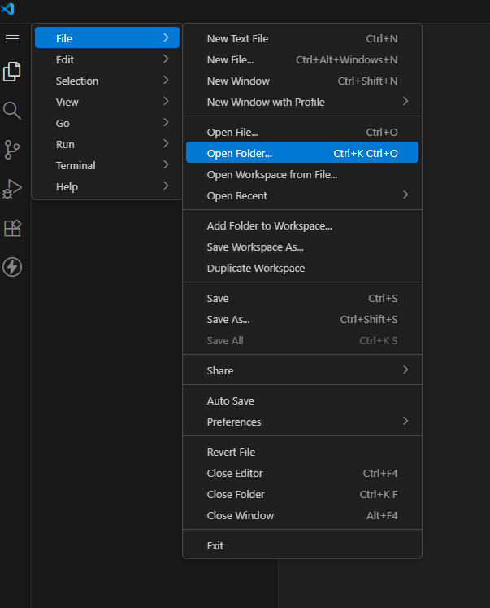
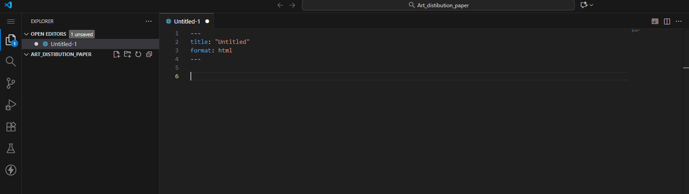
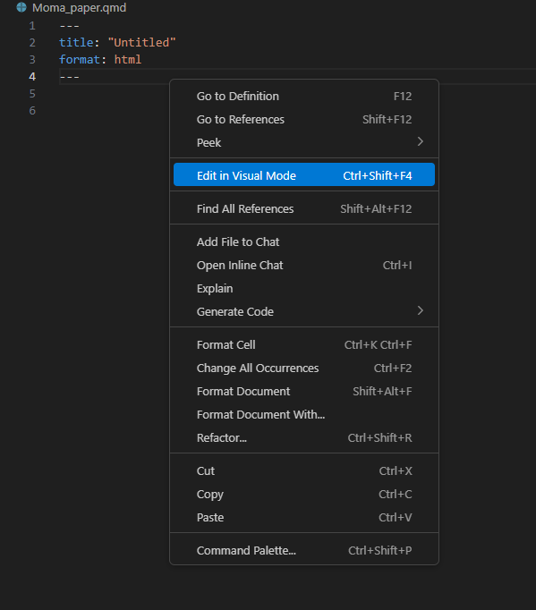
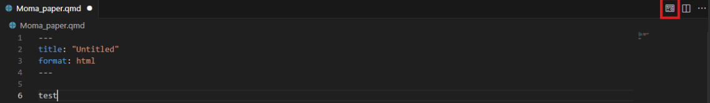
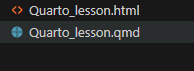
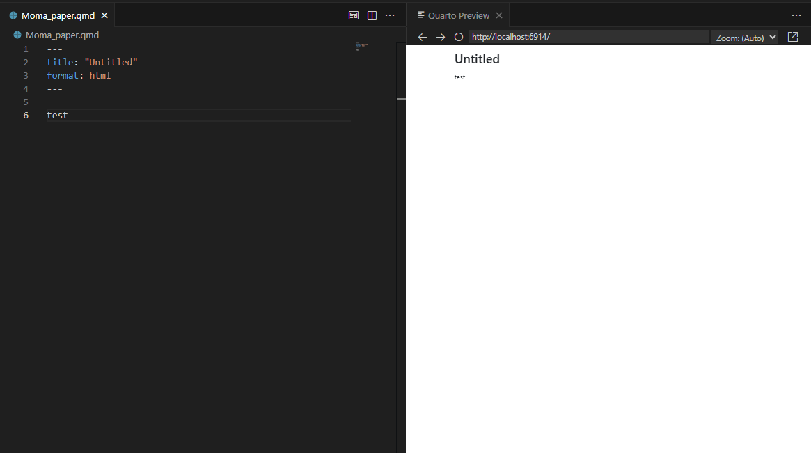

::: questions  

- How do I open a new Quarto document?
- What editing modes exist?
- How do I switch between modes?

:::

::: objectives  

- Open a new Quarto document.
- Create a working folder.
- Switch between editing modes.
:::

## Choosing your working folder

To work in a clean and organized environment, we will first create a new working folder and set it as our project directory in Visual Studio Code.

To do so, open the menu in the upper-left corner of the window (depicted as three parallel horizontal lines). From there, follow the path: **File → Open Folder**.

Here we can then create a new folder, which we call ***"Art_distribution_paper"***.
Once selected, VS Code will open the folder and set it as our new working environment. All new documents, outputs, and relevant data will be stored in this folder.

## Opening a Quarto Document

Next, we’ll create our Quarto file. Again, open the menu in the upper-left corner and follow the path: **File → New File**.

After installing the Quarto extension, two new options appear when creating a new file in VS Code:  

- **Quarto Document** — creates a single file suitable for standalone documents such as PDFs or HTML reports.  
- **Quarto Project** — offers preconfigured templates for more complex structures like blogs, books, or websites.

Since we’re focusing on the basics, we’ll select “Quarto Document” when creating a new file.

After opening the new file, you should see the following:

The “empty” document contains only a minimal YAML header with generic information about the document’s title and format.

By using the keybord shortcut *Ctrl + S*, we can now save our new Quarto document in our previously created "Art_distribution_paper" folder. We will call it *"Moma_paper"*

## Visual and Source Mode

When working in Quarto, you can choose between two editing modes:

- **Visual Mode**: Offers a WYSIWYG (What You See Is What You Get) interface similar to Microsoft Word. Markdown syntax is hidden to reduce confusion for beginners.  
- **Source Mode**: Shows the underlying Markdown code, giving you full control over formatting and structure.

Neither mode is inherently better — the choice depends on your preference and workflow.

In this lesson, we’ll work with both modes. You’ll learn how to use the visual interface to make selections and how to write the corresponding Markdown code in Source Mode.

::: callout
You can easily switch between the two editing modes by right-clicking anywhere in the document and selecting “**Edit in Visual Mode**” or “**Edit in Source Mode**”. This will instantly switch your view.

In this lesson, we will continue working in Source Mode.

:::

## Rendering Your document

To render your document and preview its final appearance, click the “**Preview**” button in the top-right corner of the screen:

Alternatively you can use **Ctrl+Shift+K**.

This will trigger two actions:

1. It generates a new output file in your “**Art_distribution_paper**” folder, matching your chosen format (e.g., PDF or HTML).

   

2. It splits your screen and displays the rendered preview on the right side of VS Code.

   

::: challenge
### Exercise:
Create a new folder called "Quarto_lesson" and open it in VSCode. Open a new Quarto document in VSCode and save it in your newly created folder.

:::

::::::::::::::::::::::::::::::::::::: keypoints

+ You can create a new working folder in Visual Studio Code.
+ There are two kinds of Quarto files: Quarto Documents and Quarto Projects.
+ You can seamlessly switch between Source Mode and Visual Mode.
+ You can render your document using the “Preview” button.

::::::::::::::::::::::::::::::::::::::::::::::
