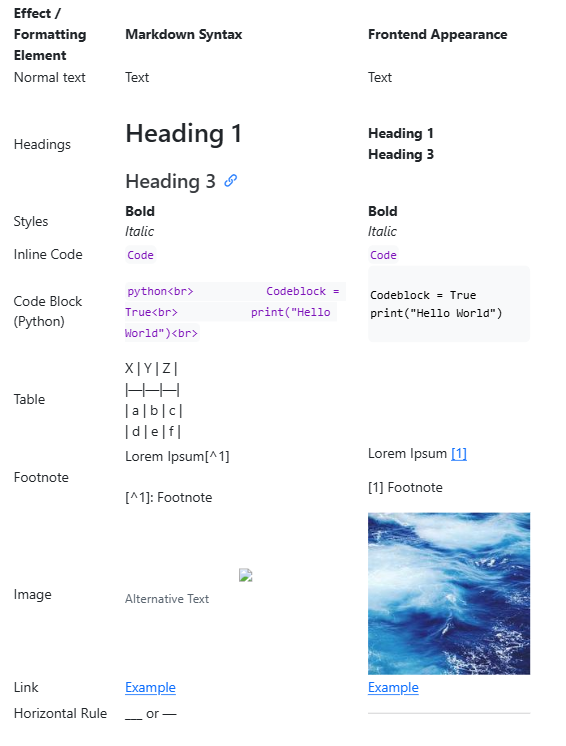
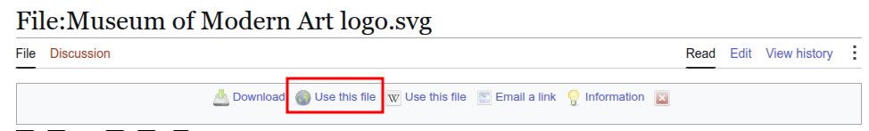
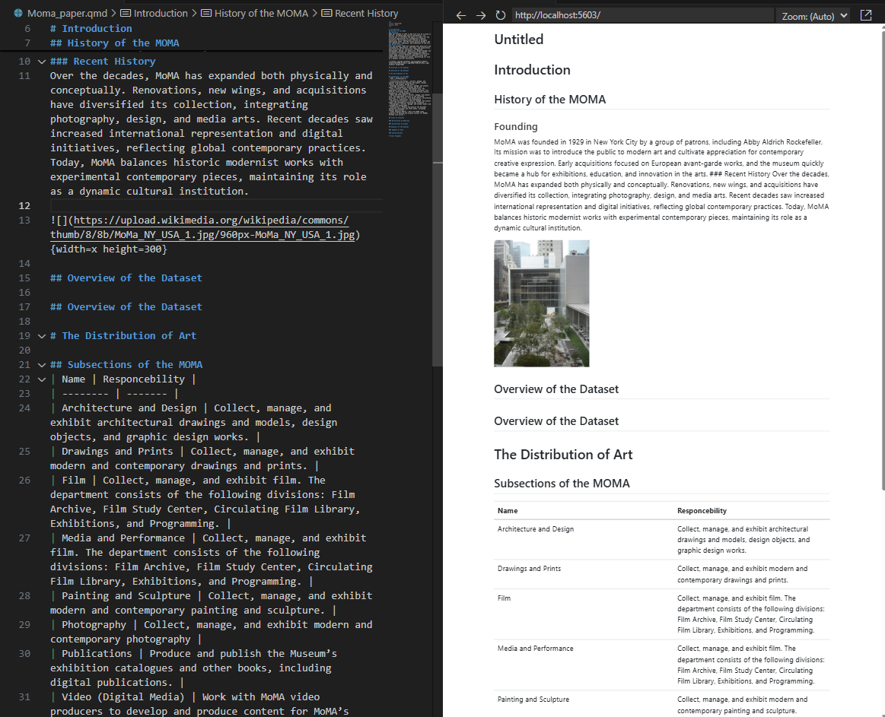

::: questions 

- What is Markdown? 
- How do you use Markdown to write in Quarto? 
- What are the most common parts of Markdown syntax?
  
:::

::: objectives

- Know the basic Markdown syntax.
- Know how to write a simple text, containing a variety of Markdown syntax.

:::

## Markdown Syntax

In order to use the source mode of Quarto, one needs to be able to write a document using the Markdown programming language.
The relative simplicity and straightforwardness of Markdown makes it one of the ideal programming languages for beginners. It is used by a variety of programs and exists in the background of most modern text-based programs.
For example, this page is based on Markdown as well!
Markdown is designed as a simple and easy to understand programming language. As such, there are only a few key features the user needs to know to create basic syntax in Markdown.
These features contain some of the most common elements of written texts, such as tables, links and footnotes. But also features used to visually improve your text with features such as bold or italicised writing, horizontal lines for text separation or differently sized headers.
The implementation of pictures is also possible to implement pictures in Markdown.
Some of the most useful parts of Markdown syntax are shown here:



## Writing our paper with Markdown

Now that we know some of the basic syntax of Markdown, we can start to write our paper!

### Implementing structure

Let’s start with some headers to give our paper some structure. For this, we start by creating a basic structure using the different tiers of headers offered by Markdown:

```
# Introduction
## History of the MOMA
### Founding
### Recent History
## Overview of the Dataset
# The Distribution of Art
## Subsections of the MOMA
## Forms of Artworks
### Distinction by Material
### Distinction by Origin
## Analysis of the Dataset
### Summary of Data
### Visualisations
# Final Thoughts
```

This structure, created by the different quantity of # in each line, creates a tiered layering of headers, subheaders and so on. The more # we put at the start of a line, the less "important" a header is.
This newly created structure will later be used by Quarto to create the section headers, as well as a table of contents.
You can put up to six # in a line.

### Implementing text

Now that we have our section headers, we can add the most important part of a paper: the text.
For this we can simply add whatever text we want to insert between our headers:

This could look like this:
```
# Introduction
## History of the MOMA
### Founding
The MoMA was founded in 1929 in New York City by a group of patrons, including Abby Aldrich Rockefeller. Its mission was to introduce the public to modern art and cultivate appreciation for contemporary creative expression. Early acquisitions focused on European avant-garde works, and the museum quickly became a hub for exhibitions, education, and innovation in the arts.
### Recent History
Over the decades, MoMA has expanded both physically and conceptually. Renovations, new wings, and acquisitions have diversified its collection, integrating photography, design, and media arts. Recent decades saw increased international representation and digital initiatives, reflecting global contemporary practices. Today, MoMA balances historic modernist works with experimental contemporary pieces, maintaining its role as a dynamic cultural institution.
## Overview of the Dataset

```

### Implementing Images

Now let’s add a few more visual elements to our texts. We could use, for example, an image and a table to do so.  

---

In regards to image implementation, there are several ways to find and add images to our paper.
One of them is to find a usable Public Domain image from a website such as Wikimedia. This can be done by following these simple steps:

1. Find an appropriate image in Wikimedia and open its site. For our porpuses we will use the [MoMA logo](https://pad.zdv.net/_link?url=https%3A%2F%2Fcommons.wikimedia.org%2Fwiki%2FFile%3AMuseum_of_Modern_Art_logo.svg)
2. On the page you should find a button called **"Use this file"**. This could look something like this:
  
3. Now you should have the File-URL and the attribution of the image as plaintext. in other case the URL is *"https://upload.wikimedia.org/wikipedia/commons/2/21/Museum_of_Modern_Art_logo.svg"* and the attribution is *"Museum of Modern Art, Matthew Carter, Public domain, via Wikimedia Commons"*

Now we need to insert our found image into our paper. To do so we can use either the URL we found via Wikimedia, or an image already found on our device.

In Markdown images are marked by an exclamation point, square brackets, round brackets and winged brackets. 

The square brackets can be left empty, but otherwise contain an alternate text for the image. Here we can also add the assotiation and copyright information we found on Wikimedia!

The round brackets contain the link or datapath of the image.

The winged brackets can be used to change the rendered image’s size and dimensions.

This could look something like this:
    

```
Using a link:
{width=x height=300}

Using a local image. The image must be in the same folder as the Quarto document!
{width=x height=300}

```
::: callout
If your images are not placed in the same folder as your Quarto document, you must copy the complete path to the directory of your image into the brackets!
For example:
```
{width=x height=300}
```
:::

### Implementing tables

Now we can add a table to our document. For this we "draw" a table in Markdown like this:
```
## Subsections of the MOMA

| Name | Responcebility |
| -------- | ------- |
| Architecture and Design | Collect, manage, and exhibit architectural drawings and models, design objects, and graphic design works. |
| Drawings and Prints | Collect, manage, and exhibit modern and contemporary drawings and prints. |
| Film | Collect, manage, and exhibit film. The department consists of the following divisions: Film Archive, Film Study Center, Circulating Film Library, Exhibitions, and Programming. |
| Media and Performance | Collect, manage, and exhibit film. The department consists of the following divisions: Film Archive, Film Study Center, Circulating Film Library, Exhibitions, and Programming. |
| Painting and Sculpture | Collect, manage, and exhibit modern and contemporary painting and sculpture. |
| Photography | Collect, manage, and exhibit modern and contemporary photography |
| Publications | Produce and publish the Museum’s exhibition catalogues and other books, including digital publications. |
| Video (Digital Media) | Work with MoMA video producers to develop and produce content for MoMA’s YouTube Live series |
```
The different sections of the table are devided by |.

When we have now added our table and image to our text, it could look something like this when rendered:


::: challenge

### Exercise:

Use your newly acquired knowledge in Markdown to fill your still empty Quarto documents with text.
Try to use a variety of features such as pictures or line breaks, be creative!
:::

::: caution
### Some Help

Should you need some help with Markdown or want to deepen your understanding of this extremely useful language, there are a plethora of websites aimed at helping newcomers learn all there is about Markdown.
Websites like [MarkdownGuide](https://www.markdownguide.org/) offer a wide variety of guides, cheat sheets and help.
:::

::::::::::::::::::::::::::::::::::::: keypoints

+ Quarto uses MArkdown as its core language
+ You can use # to create headings in Markdown
+ You can use `` to implement images
+ You can "draw" tables in Markdown

::::::::::::::::::::::::::::::::::::::::::::::
