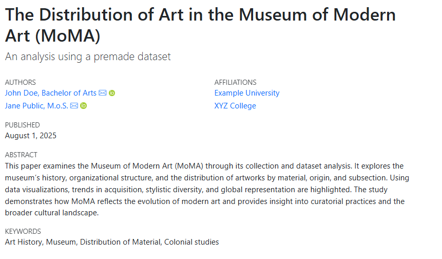

::: questions 

- What is YAML?
- How to use a YAML header? 
- What are the most useful Key-Value pairs for a scientific paper?
  
:::

::: objectives
- Create a simple YAML header containing basic information.
- Apply the correct Key-Value pairs for use in a scientific paper.
- Implement a detailled YAML header for a scientific paper.

:::

## What is YAML

Many Quarto documents start with a so-called YAML header. These headers contain fundamental information about the document and are used to concisely and easily configure metadata and appearance. While it is not necessary for the document to function, they are a useful way of integrating metadata and appearance into your documents.

YAML (short for "YAML Ain’t Markup Language") is a human-readable data language most commonly used in configuration files. At its most rudimentary, YAML uses easy-to-understand Key-Value pairs as a syntax.

In Quarto, a YAML block is signified by three dashes above and below the code block.
In order to integrate a YAML header into your document, you need to insert the following block at the top of your document and fill the space between the dashes with relevant Key-Value pairs.
Keys relevant for format and appearance will be shown in the relevant episodes!

::: Callout
A Key-Value pair is created by pairing a predetermined key (such as name, title, date, etc.) with a corresponding value.
Sub-categories are created by indenting the line with Tab. Should these indentations not be applied correctly, certain information will not be displayed correctly or be completely hidden.

:::

## Creating a simple YAML header

Now we will try to implement some basic information into the pregenerated YAML header at the top of our document.

::: challenge
### Exercise
After each of the following steps, try to fill out the different Key-Value pairs using your own data. Then try to render it to see the difference.
Be careful with indentation and spaces!
:::


First we will replace the default "Untitled" with our own title. This will replace the value of the "title" key, which was previously "Untitled".
```
    ---
    title: Example The Destribution of Art in the Museum of Modern Art (MOMA)
    ---
```

Following this we must decide which format our final, rendered document should have. The two standard options are HTML or PDF.
In this case we decide we want our paper to be in the form of a PDF. To do this we simply add it behind the "format" key:
```
    ---
    title: Example The Destribution of Art in the Museum of Modern Art (MOMA)
    format: pdf
    ---
```

Lastly we want our document to have a simple table of contents. These tables use the Markdown headers, which were discussed in the previous lesson, to generate a table of contents for your document.
In order to generate a table of contents, we use our first indented Key-Value pair. To do so we use the Tab key to indent the "toc: true" Key-Value pair. This causes it to act as an extension of the format Key-Value pair.
The "true" value acts as an on/off switch, which activates the table of contents.
```
    ---
    title: The Destribution of Art in the Museum of Modern Art (MOMA)
    format: pdf
        toc: true
    ---
```

::: callout

#### YAML Keys:

* `title:`               – Title of your paper/webpage/publication
* `format:`              – The format of your rendered document. There are a wide variety of formats to choose from. A detailed list can be found here: https://quarto.org/docs/output-formats/all-formats.html
* `toc:`                 – **Toc:true** creates a simple table of contents for your website. The headings you previously created via '#' are used to create and organize it.
  
:::


## YAML hearders for scientific publishing

There is a wide-ranging assortment of YAML pairs, which are commonly used for the implementation of metadata in scientific articles.
These pairs can contain a wide variety of information about the paper, its authors and its place of origin, as well as information on copyright, funding and other legal characteristics.
Note that not all of the pairs are necessary, and many can be omitted if they are not needed or available.
Here is an overview of some commonly used Key-Value pairs:

::: callout

### YAML Keys

* `title:`               – Title of you paper/webpage/publication
* `subtitle:`            – Possible subtitle or clarification
* `date:`                – Publishing date
* `type:`                – Type of publication. May use EPUB Publication Types or free strings
* `author:/authors:`     – Names and informations on the author or authors. Can be clarified through sub categories.
* `name:`                – Name of an author or institution
* `id:`                  – Identifier used to refer the author in other fields
* `orcid:`               – Creates a link to the author’s "Open Researcher and Contributor ID" (ORCID).  
* `email:`               – Email adress of person or institution.
* `url`                  – Associated website of person or institution
* `degree:/degrees:`     – Authors dregrees
* `affiliation`          – Affiliatiated institution. Can be clarified through sub categories
* `city/region/country:` – Name of corresponding geographic entity
* `abstract`             – Abstract of the publication
* `keywords`             – Keywords of the publication, can be more or less detailled
* `license`              – A license can be either specified through a string or by inserting a Creative Commons abbrevation
* `copyright`            – Copyright holder.  Can be clarified through sub categories
* `holder`               – Name of the copyright holder
* `year`                 – Year of the copyright
* `funding`              – If the publication received funding it can be mentioned here

:::

## Creating a YAML hearder for a scientific document

Now that we have a wide array of possible Key-Value pairs, we can use these different options to create a detailed YAML header for our paper on the MOMA and its artworks:  

### Basic information

In the first part of our YAML header, we will add some basic information about our paper, building on the basics we already learned.
The new information will be: subtitle, date of publication and type of document.

```
    ---
    title: The Destribution of Art in the Museum of Modern Art (MOMA)
    format: pdf
      toc: true
    subtitle: An analysis using a premade Dataset
    date: 2025-08-01
    type: education
    ---
```

### Information about the author(s)

In the next section of the YAML header, more information on the authors of our paper will be added.
This part is heavily reliant on the correct indentation of Key-Value pairs.
It helps to imagine the different amounts of indentation as different levels of information. In this case, higher tiers will contain clarifications and specifications of an overarching Key-Value pair.
Up until now we worked in Level 1, the base level of the YAML header.
To begin we will first create the “authors” key in this Level 1.

```
    ---
    authors: 
    ---
```

Now we will not add a value to this key.
Instead, we will create several new Key-Value pairs, which will contain information on name, IDs, email, website, degree and role.
These pairs will be added under the previously created "authors" key, and will be indented.
This will create a second Level in our YAML header, Level 2.
This indentation will make the new pairs in Level 2 act as specifications of the "authors" key.
As we are planning to add multiple authors, we will add a "-" in front of the first indented Key-Value pair. Doing this will cause all following pairs on the same indentation level and without a "-", to be counted as part of the same set of pairs.

```
    ---
    authors:
        - name: John Doe
          id: jd
          orcid: 0000 0000 0000 0000
          email: john.doe@example.com
          url: author-website.com
          degrees: Bachelor of Arts
          role: concept
    ---
```
We now also want to give our first author an affiliation with a university. This can be done with another set of indented Key‑Value pairs.
To begin we add the "affiliation" key to our set of indented pairs on Level 2:

```
    ---
    authors:
        - name: John Doe
          id: jd
          orcid: 0000 0000 0000 0000
          email: john.doe@example.com
          url: author-website.com
          degrees: Bachelor of Arts
          role: concept
          affiliation:
    ---
```

Now we repeat the same process as before. We create a new set of Key-Value pairs, this time indented further than the previous ones, creating Level 3.
In Level 3, we add the information on the institution that the author is employed by. Here we will use the keys for name, city, region, country and website.

```
    ---
    title: The Destribution of Art in the Museum of Modern Art (MOMA)
    format: pdf
      toc: true
    subtitle: An analysis using a premade Dataset
    date: 2025-08-01
    type: education
    authors:
        - name: John Doe
          id: jd
          orcid: 0000 0000 0000 0000
          email: john.doe@example.com
          url: author-website.com
          degrees: Bachelor of Arts
          role: concept
          affiliation:
              - name: Example University
                city: Towncity
                region: Arearegion
                Country: Countryland
                url: univerity-website.com
    ---
```

After we added our first author, we need to add our co-author.
For this we switch back to Level 2, where we will add another set of the previously used pairs (name, IDs, etc.). The first one will again have a "-", in order to mark this as a new set of information. We will also add another Level 3 set for author two’s affiliations.

```
    ---
    title: The Destribution of Art in the Museum of Modern Art (MOMA)
    format: pdf
      toc: true
    subtitle: An analysis using a premade Dataset
    date: 2025-08-01
    type: education
    authors:
        - name: John Doe
          id: jd
          orcid: 0000 0000 0000 0000
          email: john.doe@example.com
          url: author-website.com
          degrees: Bachelor of Arts
          role: concept
          affiliation:
              - name: Example University
                city: Towncity
                region: Arearegion
                Country: Countryland
                url: univerity-website.com
        - name: Jane Public
          id: jp
          orcid: 1111 2222 3333 4444
          email: jane.p@example.com
          url: janesawesomewebsite.net
          degrees: M.o.S.
          role: visuals
          affiliation:
              - name: XYZ Collage
                city: Villageville
                region: Random County
                Country: Republic of Example
                url: collage-page.com
    ---
```

### Abstract and Keywords

In the following part we will switch back to Level 1, where we add two more Key‑Value pairs.
These will contain the paper's abstract and the useful keywords.
For our abstract we will add the "abstract" key, followed by a "|". This will inform Quarto that the relevant information for the value will be added in the next line.
In the following line, we then simply add our text.
As for the keywords, we use the "keywords" key. Here we can add the relevant keywords as a list in the following lines. Each item on the list will be denoted with a "-", like we did it for the different authors previously.

```
    ---
    abstract: |
        This paper examines the Museum of Modern Art (MoMA) through its collection and dataset analysis. It explores the museum’s history, organizational structure, and the distribution of artworks by material, origin, and subsection. Using data visualizations, trends in acquisition, stylistic diversity, and global representation are highlighted. The study demonstrates how MoMA reflects the evolution of modern art and provides insight into curatorial practices and the broader cultural landscape.
    keywords:
    - Art History
    - Museum
    - Distibution of Material
    - Colonial studies
    
    ---
```
### License, Copyright and Funding

Continuing in Level 1, we add information on the license of our paper. Any form of license can be used as a value in this case.
As we want to give some more information on the copyright, we create a "copyright" key in Level 1, before switching to Level 2 to add information on holder and year.
Lastly, we go back to Level 1 to add some information on our project’s funding.
```
    ---
    license: "CC BY ND"
    copyright: 
      holder: John Doe
      year: 2025
    funding: If your research was funded it can be written here.
    ---
```

### The final look

After we added everything to our YAML header, it should look something like this:

```
    ---
    title: The Destribution of Art in the Museum of Modern Art (MOMA)
    format: pdf
      toc: true
    subtitle: An analysis using a premade Dataset
    date: 2025-08-01
    type: education
    authors:
        - name: John Doe
          id: jd
          orcid: 0000 0000 0000 0000
          email: john.doe@example.com
          url: author-website.com
          degrees: Bachelor of Arts
          role: concept
          affiliation:
              - name: Example University
                city: Towncity
                region: Arearegion
                Country: Countryland
                url: univerity-website.com
        - name: Jane Public
          id: jp
          orcid: 1111 2222 3333 4444
          email: jane.p@example.com
          url: janesawesomewebsite.net
          degrees: M.o.S.
          role: visuals
          affiliation:
              - name: XYZ Collage
                city: Villageville
                region: Random County
                Country: Republic of Example
                url: collage-page.com
    abstract: |
        This paper examines the Museum of Modern Art (MoMA) through its collection and dataset analysis. It explores the museum’s history, organizational structure, and the distribution of artworks by material, origin, and subsection. Using data visualizations, trends in acquisition, stylistic diversity, and global representation are highlighted. The study demonstrates how MoMA reflects the evolution of modern art and provides insight into curatorial practices and the broader cultural landscape.
    keywords:
    - Art History
    - Museum
    - Distibution of Material
    - Colonial studies
    
    license: "CC BY ND"
    copyright: 
      holder: John Doe
      year: 2025
    funding: If your research was funded it can be written here.
    ---
```
After this, we have added all of our metadata as Key-Value pairs. Let’s see how the rendered HTML version looks in Quarto:



::: challenge

### Exercise
Now we will try to create a detailed YAML header for your own document.
Your header should contain information on: Author (name, email, degree, role, affiliation), title and subtitle, date, keywords, copyright and funding.

:::

::::::::::::::::::::::::::::::::::::: keypoints

* YAML headers dictate the metadata and appearence of your document.
* YAML headers are made out of Key-Value pairs.
* Key-Value pairs consist of a predetermined key and a corresponding value
* All Quarto documents contain simple YAML headers
* Scientific papers utilize a wide variety of Key-value pairs to implement metadata

::::::::::::::::::::::::::::::::::::::::::::::
