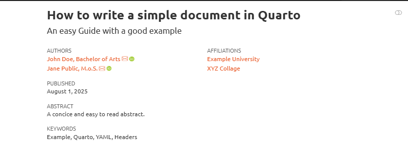

::: questions

- What unique options exist for PDFs in Quarto?
- What unique options exist for HTML in Quarto?

:::

::: objectives

- Implement format, font and documentclass characteristics in a PDF Quarto document.
- Implement themes in a HTML Quarto document.

:::


Every different format of Quarto has its own unique commands and output‑specific code. These are most often part of the YAML header.  

As there is a large array of possible key‑value pairs, making it possible to customize many different and minute aspects of Quarto, we will only show you some of the more simple and easy‑to‑understand key‑value pairs.  

But as the theory behind all YAML pairs and their resulting changes and modifications is the same, you can freely experiment with all offered possibilities to find the options that fit your preferred visual and editorial style.

## PDF

In the case of a PDF, these mainly dictate things such as the font used, the dimensions of the PDF, and the class of PDF used.

A comprehensive overview of all possible YAML commands can be found. [here](https://quarto.org/docs/reference/formats/pdf.html)

### Documentclass

The document class given in YAML functions as a shorthand used to immediately change a variety of characteristics.  

The main document classes used in Quarto PDFs are: article, book, and report.  

These classes offer the following benefits:  

**Article:**  
- used mainly for short texts that are not divided into chapters  
- formatted in single‑column text with the author and title of the article at the top  

**Report:**  
- used mainly for longer texts that are divided into different chapters  
- automatically generates a front page with the author and title  

**Book:**  
- used for publishing complete books  
- supports division into front matter, main matter, and back matter  
- integrates publishing‑ and print‑friendly dimensions

### Fonts and colours

Quarto allows you to edit every font used by different syntaxes in its YAML header.
To do so, you can add the relevant font type followed by a typeset into the header.

For example:

```yaml
mainfont:  "Times New Roman"  Sets Times New Roman as font for the main text
sansfont: "Open Sans"         Sets Open Sans as a font for headings
    - Color=39729E            Sets the Color of headings using a HexCode
```

The color of different parts of the PDF can be changed using a similar code.

For example:

```yaml
linkcolor:    Sets the color for links
toccolor:     Sets the color for the Table of Contents

```

### Layout

Lastly, one can use a variety of commands in order to change the general layout of the document, such as margins, paper size, and geometry.


```yaml
title: "My Document"
format: 
  pdf: 
    documentclass: article
    geometry:
      - top=30mm
      - left=20mm
      - heightrounded
```

## HTML

Many of the options available for PDFs are also or similarly available for HTML‑based Quarto documents. They allow you to customise familiar options such as the Table of Contents, fonts, or visibility of links. 
A comprehensive overview of all available options can be found. [here](https://quarto.org/docs/reference/formats/html.html) 

A more unique possibility for HTML formats is the so‑called themes, which allow you to give your website a more concise and complete visual overhaul.
They change a variety of aesthetic characteristics such as highlight colours, fonts, and layout.
Quarto uses 25 themes from the Bootswatch project. A full overview can be found [here](https://bootswatch.com/)
Multiple themes can be used in order to, for example, implement a Dark and Light mode to your website.
To implement such a theme, you simply need to add it to your YAML header like this:

```yaml
  html: 
    theme:
      light: united
      dark: darkly
```
The following example uses the two styles shown above:




::: challenge

### Exercise:
Decide if you would like to continue with a PDF or HTML. Then try out the new YAML headers and options in your document. Be creative!

:::

::::::::::::::::::::::::::::::::::::: keypoints

+ When rendering as a PDF, the YAML header can be used to select templates, layouts and fonts
+ When rendering as HTML, the YAML header can be used to select different themes

::::::::::::::::::::::::::::::::::::::::::::::
